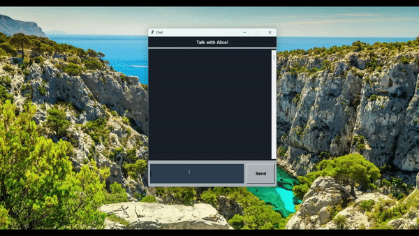

# Chatbot with TensorFlow and BERT 🤖

## Chatbot with Tkinter and TensorFlow

The `Chatbot Model` was trained with a simple Dataset and using TensorFlow and the BERT Transformer Model to Convert all the Words from the User to Numbers, and the U.I. was Built with Tkinter.

## Check-it out
- Chatbot Preview: https://youtu.be/y-IDmv-HLRw
